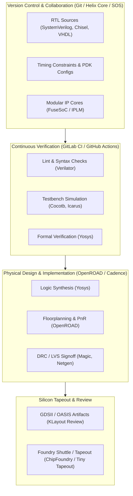

  

# 🚀 Awesome Chip Design Collaboration
### *Curated List of SaaS Platforms, Cloud EDA, Hardware Version Control & Open-Source Silicon Ecosystems*

**Keywords**: `Semiconductor Collaboration` • `EDA Cloud` • `Design Data Management (DDM)` • `IP Lifecycle Management (IPLM)` • `RTL-to-GDSII` • `Hardware DevOps` • `Silicon Tapeout`

---

## 📖 Overview

Modern Integrated Circuit (IC), ASIC, SoC, and PCB design processes require multi-disciplinary engineering teams across global locations to collaborate on massive design trees, binary assets (GDSII, OASIS, LEF/DEF), analog schematics, RTL codebases, and physical verification checks.

This repository is a definitive, SEO-optimized directory tracking **commercial SaaS/hosted platforms** and **open-source projects** enabling collaborative chip design workflows from concept through RTL simulation, logic synthesis, place-and-route (PnR), and tapeout.

---

## 📑 Table of Contents
- [🏢 SaaS & Hosted Platforms](#-saas--hosted-platforms)
- [🌐 Open-Source GitHub Projects](#-open-source-github-projects)
- [🏗️ Collaborative Chip Design Architecture](#️-collaborative-chip-design-architecture)
- [🤝 How to Contribute](#-how-to-contribute)
- [📈 Star History](#-star-history)
- [⚖️ Disclaimer & Licensing](#-disclaimer--licensing)

---

## 🏢 SaaS & Hosted Platforms

> 📊 **Sector Market Size & Structure**: The Electronic Design Automation (EDA) and Semiconductor Product Lifecycle & Design Data Management (PLM/DDM/IPLM) market is estimated at **$16.5B – $21.8B** (projected to exceed **$30B+ by 2030** at ~11.2% CAGR). The market is **highly concentrated (oligopoly)** among major incumbents (Siemens, Cadence, Synopsys, Dassault Systèmes, Keysight) with extreme IP lock-in and mission-critical sign-off requirements, while modern SaaS providers and hardware DevOps tools address cloud-native scalability and agile chip development.

*The table below ranks SaaS & hosted chip collaboration solutions sorted in descending order by parent company market capitalization / valuation.*

| Platform | Company Valuation / Scale | Description / Focus | Starting Pricing | Free Tier / Free Trial Limits |
| :--- | :--- | :--- | :--- | :--- |
| **[Siemens Teamcenter EDA](https://www.siemens.com/)** | **~$220B Market Cap** (Siemens AG) / ~€78B+ Ann. Rev | Cloud-native PLM and design data management (Teamcenter X) tailored for semiconductor, PCB, and multi-domain engineering collaboration. | Starts at **$165.38/user/month** (Teamcenter X Essentials tier, billed annually) | **30-day free trial** with pre-configured cloud sandbox, guided tutorials, and sample dataset access. |
| **[Cadence Cloud](https://www.cadence.com/)** | **~$85B Market Cap** (Cadence Design Systems) / ~$6.3B Ann. Rev | Cloud EDA environment offering SaaS access to digital/analog design, simulation, and verification tools (OrCAD, Allegro, Clarity, Sigrity). | Starts at **$10/token** via OnCloud (pay-as-you-go packages on 30-day renewal cycles; tool burn rates start at ~0.75 tokens/hr) | **30-day free trial** capped at **8 compute hours** (whichever expires first) for select OnCloud packages. |
| **[Cliosoft SOS](https://www.keysight.com/)** | **~$55B Market Cap** (Keysight Technologies) / ~$6.1B Ann. Rev | Purpose-built IC design data management and hardware version control platform (Keysight EDM) supporting analog/mixed-signal and digital EDA flows. | Starts at **~$2,000/seat/year** (entry multi-user licensing bundles for IC design teams) | **30-day evaluation trial license** available via Keysight Knowledge Center registration with host ID validation. |
| **[DesignSync](https://www.3ds.com/)** | **~$28B Market Cap** (Dassault Systèmes) / ~€6.5B Ann. Rev | Semiconductor design data management (ENOVIA portfolio) integrated with EDA frameworks (Cadence Virtuoso, Synopsys) for multi-site IC vaulting. | Starts at **~$345/user/quarter** (~$115/user/month) for entry 3DEXPERIENCE cloud platform access | **14 to 30-day proof-of-concept (PoC) evaluation** upon vendor qualification (guided technical onboarding; no open self-service trial). |
| **[GitLab](https://about.gitlab.com/)** | **~$7.2B Market Cap** (GitLab Inc.) / ~$1.1B Ann. Rev | DevOps & CI/CD platform widely adopted by hardware teams for RTL versioning, continuous verification pipelines, and IP governance. | Starts at **$29/user/month** (Premium tier, billed annually at $348/year); **$0/month** (Free tier) | **Free forever plan**: Up to 5 users/namespace, 400 CI/CD compute minutes/month, and 5 GiB storage/namespace; **30-day free trial** for Ultimate. |
| **[Altium 365](https://www.altium.com/altium-365)** | **~$5.9B Valuation** (Acquired by Renesas Electronics) / ~$260M ARR | Cloud collaboration platform for PCB and electronics design — shared workspaces, version control, review, and supply-chain data tightly integrated with Altium Designer. | Starts at **$1,990/year** (Altium Develop tier) / **$3,850/seat/year** (Standard Plan) | **30-day free trial** with full platform access (designs lock to read-only post-trial); perpetual free access to web-based **Altium 365 Viewer** (read/markup only). |
| **[Methodics IPLM](https://www.perforce.com/products/helix-iplm)** | **~$3.5B Valuation** (Perforce Software / Clearlake) / ~$500M+ Ann. Rev | IP Lifecycle Management platform (Helix IPLM) delivering IP cataloging, metadata tracking, dependency management, and traceability for SoC teams. | Starts at **~$2,500/user/year** (entry enterprise subscription tier for IP tracking and catalog modules) | **14-day guided proof-of-concept (PoC) trial** with sandbox access upon sales qualification (no public self-serve tier). |
| **[Perforce Helix Core](https://www.perforce.com/products/helix-core)** | **~$3.5B Valuation** (Perforce Software / Clearlake) / ~$500M+ Ann. Rev | Scalable version control system built for massive binary and IC design repositories (GDSII, OASIS, analog/digital assets). | Starts at **$39/user/month** (P4 Cloud managed SaaS; includes 64 GiB storage); **$0** for self-managed server | **Free forever plan** for up to **5 users and 20 workspaces** (self-hosted / BYO cloud instance); managed P4 Cloud SaaS does not offer a free trial. |
| **[Aldec HES-DVM](https://www.aldec.com/)** | **~$100M–$150M Est. Valuation** (Aldec, Inc.) / ~$35M–$50M Ann. Rev | Hardware emulation, prototyping, and verification platform supporting multi-user simulation acceleration and FPGA prototyping workflows. | Starts at **~$1,500/seat/year** for desktop verification tiers (Riviera-PRO/Active-HDL; enterprise emulation quoted per seat/capacity) | **20-day free evaluation trial** (fully functional, node-locked license tied to MAC address); perpetual free **Student Edition** for coursework. |
| **[OpenLane Cloud / ChipFoundry](https://chipfoundry.io/)** | **~$10M–$15M Seed Valuation** (UmbraLogic / ChipFoundry) | Turnkey open-silicon shuttle and cloud-hosted RTL-to-GDS flow hosting (ChipFoundry / Tiny Tapeout / OpenROAD ecosystem) for collaborative chip tapeouts. | Starts at **€70/tile** (~$75/tile via Tiny Tapeout) / **$3,500** for ChipIgnite Mini shuttle; OpenLane engine is **$0 (open-source)** | **Free forever tier**: Unlimited local RTL-to-GDS runs via open-source toolchain; shuttle verification CI and DRC/LVS preview checks are free. |

---

## 🌐 Open-Source GitHub Projects

*Sorted in descending order by GitHub star popularity.*

1. **[Git](https://github.com/git/git)**   
   Foundational distributed version control system utilized across open-source and commercial hardware teams for HDL codebases, constraints, and tool automation scripts.

2. **[Gitea](https://github.com/go-gitea/gitea)**   
   Lightweight, self-hosted Git service popular for on-premises, air-gapped semiconductor development environments requiring rapid code review and Git LFS artifact support.

3. **[Yosys](https://github.com/YosysHQ/yosys)**   
   Framework for Verilog RTL synthesis, formal verification, and custom EDA algorithm research; core synthesis engine for modern open ASIC pipelines.

4. **[Chisel](https://github.com/chipsalliance/chisel)**   
   Hardware construction language embedded in Scala that enables parameterizable, reusable digital circuit generation and collaborative hardware IP engineering.

5. **[Verilator](https://github.com/verilator/verilator)**   
   High-performance open-source Verilog and SystemVerilog simulator that compiles synthesizable HDL into multi-threaded C++ or SystemC models for rapid testbench execution.

6. **[LiteX](https://github.com/enjoy-digital/litex)**   
   Migen/Python-based SoC design framework providing infrastructure to interconnect cores, create memory controllers, and automate FPGA/ASIC SoC build pipelines.

7. **[Cocotb](https://github.com/cocotb/cocotb)**   
   Coroutine-based co-simulation testbench framework for verifying VHDL/Verilog/SystemVerilog RTL using Python, streamlining CI/CD regression testing across hardware teams.

8. **[SpinalHDL](https://github.com/SpinalHDL/SpinalHDL)**   
   Scala-based high-level hardware description language designed to enhance code reuse, safety, type checking, and modular hardware collaboration.

9. **[OpenLane](https://github.com/The-OpenROAD-Project/OpenLane)**   
   Automated RTL-to-GDSII flow built on OpenROAD, Yosys, Magic, and KLayout for clean, reproducible ASIC tapeouts with zero human-in-the-loop intervention.

10. **[OpenROAD](https://github.com/The-OpenROAD-Project/OpenROAD)**   
    Autonomous open-source digital semiconductor physical design toolchain performing floorplanning, placement, clock tree synthesis (CTS), global/detailed routing, and timing analysis.

11. **[Icarus Verilog](https://github.com/steveicarus/iverilog)**   
    Established IEEE-1364 Verilog simulation and synthesis engine used across educational, research, and production regression testing flows.

12. **[SiliconCompiler](https://github.com/siliconcompiler/siliconcompiler)**   
    Modular, Python-first compiler framework that standardizes multi-tool EDA build workflows (commercial and open-source) with continuous integration and cloud execution.

13. **[KLayout](https://github.com/KLayout/klayout)**   
    High-speed mask layout viewer and editor supporting GDSII, OASIS, and DEF formats with robust Python/Ruby scripting for collaborative tapeout visual review and DRC checking.

14. **[SkyWater 130nm Open PDK](https://github.com/google/skywater-pdk)**   
    First open-source, manufacturable Process Design Kit released by Google & SkyWater Technology Foundry, establishing frictionless collaborative open silicon tapeouts.

15. **[FuseSoC](https://github.com/olofk/fusesoc)**   
    Package manager, IP library distributor, and build management tool for hardware description languages (Verilog, VHDL, Chisel) enabling modular IP core sharing.

16. **[Magic VLSI](https://github.com/RTimothyEdwards/magic)**   
    Renowned open-source layout tool and design-rule checker widely employed in open PDK physical verification, extraction, and tapeout flows.

17. **[Tiny Tapeout IHP PDK](https://github.com/TinyTapeout/tinytapeout-ihp013)**   
    Multi-project wafer (MPW) infrastructure making open chip manufacturing accessible to hobbyists and engineering teams on 130nm BiCMOS and CMOS silicon nodes.

18. **[Netgen](https://github.com/RTimothyEdwards/netgen)**   
    Open-source LVS (Layout Versus Schematic) tool capable of circuit comparison, netlist format translation, and structural pin-matching in silicon verification.

19. **[OpenFASOC](https://github.com/idea-fasoc/OpenFASOC)**   
    Fully automated open-source analog and mixed-signal IC generation framework converting high-level user specifications into GDSII tapeouts.

---

## 🏗️ Collaborative Chip Design Architecture

---

## 🤝 How to Contribute

We welcome community contributions! To add a new platform, tool, or update pricing details:

1. **Fork the Repository** on GitHub.
2. **Add / Modify Entries** in [`README.md`](README.md):
   - For SaaS products: Provide Platform name, Company Scale, Description, Starting Price, and Free Tier/Trial limits.
   - For Open-Source repos: Provide Repo name, dynamic Star badge, and a concise 1–2 sentence description.
3. **Keep Information Objective** and link to authoritative project sources.
4. **Submit a Pull Request** with a brief summary of the changes.

---

## 📈 Star History

---

## ⚖️ Disclaimer & Licensing

- **Community Curated**: This repository is maintained for educational, research, and engineering reference purposes.
- **Export Control & IP Compliance**: Semiconductor and integrated circuit design often involves export-controlled technology (EAR/ITAR) and proprietary foundry PDKs. Ensure all cloud and collaborative tools are configured with appropriate access governance and legal compliance.
- **License**: Published under the [Creative Commons Zero v1.0 Universal](LICENSE) (CC0 1.0) Public Domain Dedication.

---

🌟 **Curated with ❤️ by [Ishan Dutta](https://github.com/ishandutta2007) and the open semiconductor community.** 🌟  
*Explore the broader collection on [Awesome-Awesome-Awesome](https://github.com/ishandutta2007/Awesome-Awesome-Awesome).*

